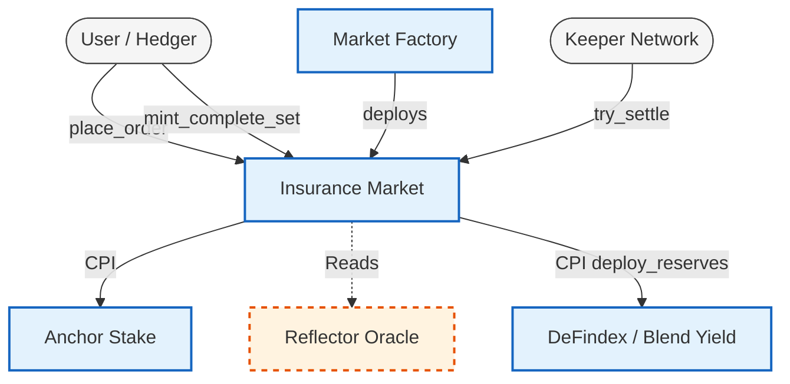
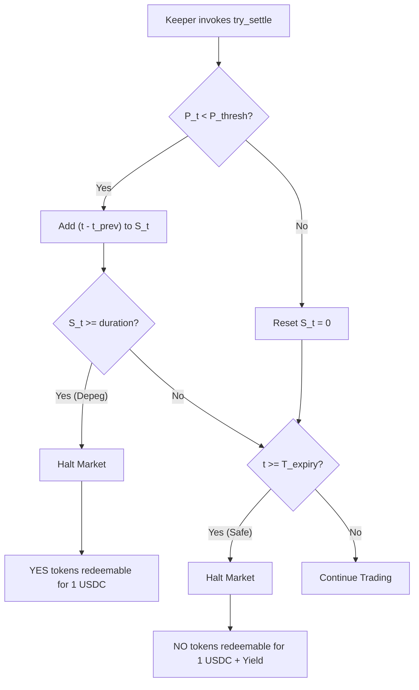

# 1. Introduction

The decentralized economy operates on the assumption of stablecoin parity. However, historical events have demonstrated that fiat-backed and algorithmic stablecoins can deviate significantly from their pegs, triggering cascading liquidations across lending protocols and automated market makers (AMMs). 

Existing risk mitigation tools are inadequate for institutional treasuries. Traditional decentralized insurance requires subjective claims assessment, leading to uncertain payout timelines. Conversely, naive parametric designs often rely on instantaneous oracle reads, making them vulnerable to single-block oracle manipulation or highly transient flash-crashes that do not reflect true economic depegs.

**Contribution.** We present AnchorShield, a vertically integrated parametric hedging stack built as isolated Soroban smart contracts on the Stellar network. AnchorShield provides a tractable primitive: users can lock collateral to buy or sell explicitly timed risk exposure to a specific asset's peg. The protocol introduces a **Dual-Timer mechanism** that explicitly separates the market's lifespan from the required duration of a depeg event, thereby neutralizing flash-crash MEV (Maximal Extractable Value) attacks. Furthermore, AnchorShield integrates with native Stellar yield primitives (e.g., DeFindex, Blend) to ensure underwriting capital remains highly capital-efficient while locked.

**Legal Disclaimer.** *This Litepaper outlines the technical architecture and roadmap for AnchorShield v1. Parameters, external integrations, and mechanics described herein—particularly regarding external yield routing and AI analytics—represent the planned protocol architecture and may be subject to change following rigorous risk audits and mainnet deployment.*

# 2. Theoretical Foundation: The Dual-Timer Model

The core innovation of AnchorShield’s settlement engine is the decoupling of market maturity from breach validation. We define the state of the market using two independent time parameters.

Let $T_{expiry}$ denote the absolute Unix timestamp at which the market matures. Let $\Delta t_{breach}$ denote the required continuous duration (in seconds) that an asset must remain below its peg to trigger a settlement.

At any given time $t$, the protocol reads the asset price $P_t$ from a pull-based oracle (e.g., Reflector). We define a threshold price $P_{thresh}$ (e.g., $\$0.995$). 

The breach stopwatch, $S_t$, is governed by the following state transition:

$$
S_{t} = 
\begin{cases} 
S_{t-1} + (t - t_{prev}) & \text{if } P_t < P_{thresh} \\
0 & \text{if } P_t \geq P_{thresh} 
\end{cases}
$$

A payout is mathematically authorized if and only if:

$$ S_t \geq \Delta t_{breach} \quad \text{AND} \quad t \leq T_{expiry} $$

If the asset recovers ($P_t \geq P_{thresh}$) before $\Delta t_{breach}$ is reached, the stopwatch $S_t$ resets to zero. A depeg must be **sustained continuously** to trigger a payout. This formulation protects underwriters from anomalous 1-second API glitches or oracle misreports.

# 3. Protocol Architecture

AnchorShield is decomposed into isolated Soroban programs, communicating via Cross-Program Invocation (CPI). The execution path is intentionally directed to prevent re-entrancy.

1. **Market Factory:** The central registry that deploys new `InsuranceMarket` contracts. It enforces configuration invariants (e.g., ensuring $T_{expiry} > \text{now}$) and tracks active markets.
2. **Insurance Market:** The execution layer. Handles symmetric token minting, maintains the on-chain Limit Order Book (LOB), and executes the settlement logic. Each market operates in its own isolated state space to contain risk.
3. **Anchor Stake:** A global contract tracking the Anchor Confidence Ratio (ACR), utilizing data from the active markets to quantify the total underwriting capital risking itself to insure a specific asset.

## 3.1 Numerical Precisions and State

All on-chain math is integer-based. Floating point is strictly forbidden in Soroban program execution.

| Constant | Value | Domain |
| :--- | :--- | :--- |
| `PRICE_PRECISION` | $10^7$ | Reflector Oracle USD prices |
| `QUOTE_PRECISION` | $10^7$ | USDC native units (Stroops) |
| `PREMIUM_BPS` | $10^4$ | Limit order prices in basis points |
| `ACR_SCALAR` | $10^9$ | Anchor Confidence Ratio precision |

# 4. Tokenization and Orderbook Accounting

AnchorShield utilizes a strictly symmetric, fully-collateralized minting mechanism. 

## 4.1 Symmetric Minting
To initiate a position, an underwriter deposits an amount $K$ of the base collateral (USDC) into the market's escrow. The contract atomically mints $K$ YES tokens (representing the payout claim) and $K$ NO tokens (representing the principal claim).

Because $1 \text{ YES} + 1 \text{ NO} = 1 \text{ USDC}$, the protocol is unconditionally solvent at all times.

## 4.2 The Limit Order Book (LOB)
Tokens are traded on a fully on-chain, price-time priority limit order book. A hedger seeking protection does not mint tokens; rather, they submit a `place_order` instruction to buy YES tokens from underwriters. 

The premium $p$ (where $0 < p < 1$) paid for a YES token is determined organically by market participants based on the perceived probability of a depeg event before $T_{expiry}$, combined with the opportunity cost of the locked capital.

# 5. Yield Integration: Maximizing Capital Efficiency

Capital inefficiency is the primary friction point for decentralized insurance underwriters. AnchorShield solves this via an idle-yield fallback architecture.

When USDC is locked in the `InsuranceMarket` escrow, it is not required to sit idle. The protocol is designed to execute a CPI call to external Stellar yield aggregators (such as DeFindex or Blend) via a dedicated `yield_.rs` module. 

$$ \text{Total Underwriter Return} = \text{Premium Collected} + \text{Native DeFi Yield} $$

If the underlying yield protocol experiences downtime or liquidity constraints, AnchorShield's CPI implementation catches the error and degrades gracefully—the USDC remains safely in the local contract escrow. 

# 6. Settlement and Permissionless Keepers

AnchorShield operates without administrative intervention. State transitions are "cranked" by an open network of Keeper bots.

Anyone may invoke the `try_settle(env)` function. The contract queries the Reflector oracle, updates $S_t$, and checks the settlement predicate. 

* **If YES wins (Sustained Breach):** The market halts immediately, preempting $T_{expiry}$. YES holders claim $1.00 USDC per token.
* **If NO wins (Expiry Reached):** The market halts at $T_{expiry}$. NO holders claim their $1.00 USDC principal plus accrued DeFindex yield.

**Keeper Incentives:** Future protocol upgrades will introduce a fractional settlement fee distributed directly to the Keeper address that successfully executes a valid `try_settle` or `fill_orders` instruction, establishing a robust, self-sustaining execution layer.

# 7. Anchor Confidence Ratio (ACR) and AI Analyst

AnchorShield extends beyond execution to provide systemic risk data to the broader Stellar ecosystem.

**The ACR Metric:** The protocol continuously calculates the Anchor Confidence Ratio (ACR)—the total notional value of NO tokens staked against an asset divided by its circulating supply. A high ACR indicates deep market confidence, serving as a decentralized credit score for stablecoins that external wallets and DEXs can query on-chain.

**AI Risk Analyst:** To assist institutions in pricing premiums, AnchorShield integrates an AI-driven macro analyst. This off-chain service ingests real-time order book spreads, global ACR trends, and external stablecoin reserve attestations to generate predictive risk assessments, bridging the gap between on-chain execution and off-chain macroeconomics.

# 8. Limitations and Security Properties

We collect the protocol's structural invariants here:

| Invariant | Enforcement |
| :--- | :--- |
| $\Sigma YES = \Sigma NO = \Sigma USDC_{locked}$ | `mint_complete_set` mints atomically and enforces 1:1:1 collateral ratio. |
| $S_t \leq (t_{now} - t_{first\_breach})$ | The stopwatch $S_t$ strictly resets if $P_t \ge P_{thresh}$ during any `try_settle` execution. |
| `oracle_staleness` < 60s | Pyth/Reflector read aborted if timestamp exceeds freshness window. |

We explicitly define the protocol's trust assumptions:
* **Oracle Dependence:** Settlement is strictly bound to the integrity of the configured pull oracle (Reflector). Prolonged oracle downtime may prevent the stopwatch $S_t$ from advancing. The protocol enforces an `ORACLE_FRESHNESS` check to reject stale pricing.
* **Yield Strategy Risk:** Capital deployed to DeFindex/Blend inherits the smart contract risk of the external venue.
* **LOB Liquidity:** During periods of extreme market volatility, the limit order book may experience widened spreads, impacting the cost of entering a hedge.

# 9. Conclusion

AnchorShield provides a highly rigorous, non-custodial framework for stablecoin risk transfer. By combining a mathematically strict Dual-Timer settlement engine with permissionless order books and external yield integrations, the protocol delivers the capital efficiency and deterministic execution required by institutional DeFi participants on Stellar.
